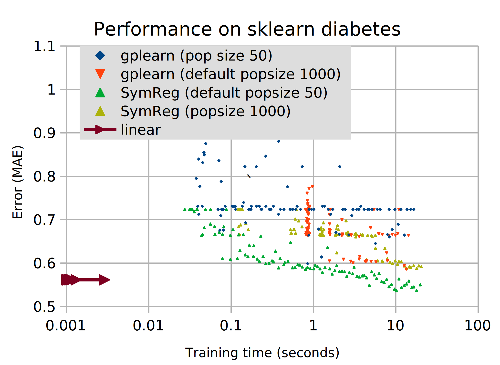

SymReg is a Symbolic Regression library aimed to be easy to use and fast.

You can use it to find expressions trying to explain a given output from given inputs. The expressions can use arbitrary building blocks, not just weighted sums as in linear models.

It works with a modified [NSGA-II](https://ieeexplore.ieee.org/document/996017) algorithm, and applies NumPy functions for vectorized evaluation of input.

SymReg is available on PyPI: you can install it using `pip install symreg`.

## Usage demo

```python
from symreg import Regressor
import random

random.seed(0)

r = Regressor(stagnation_limit=20, verbose=True)
X = [[random.random()-.5, random.random()-.5] for _ in range(100)]
y = [(x[0] + x[1])/2 for x in X]     # We want the average of the arguments

r.fit(X, y)

for score in r.results():
    print(score)

# {'error': 0.19027682154977618, 'complexity': 1, 'program': Program('$0', 2)}
# {'error': 0.13948173984343024, 'complexity': 3, 'program': Program('div $0 1.8705715685399509', 2)}
# {'error': 0.0, 'complexity': 5, 'program': Program('div add $0 $1 2.0', 2)}

r.predict([4, 6])
# array([5.])
# The mean of 4 and 6 is 5. Correct!

r.predict([[4, 6], [1, 2]])
# array([5. , 1.5])
# It also handles vectorized data.
# Here, $0=4 and $1=6 for the first row, and $0=1 and $1=2 for the second row in the 2d array.
```

You can see more examples of usage in the [Jupyter Notebook file](Metaopt.ipynb).

## Inspiration

The following projects inspired me:

 * [Eureqa Formulize](http://nutonian.wikidot.com/) - a proprietary piece of 
 otherwise-great software, which is not available anymore
 * [gplearn](https://github.com/trevorstephens/gplearn) - which is Free Software and offers strict `scikit-learn` compatibility (support pipeline and grid search), but does not support multiobjective optimization
 
 Contrary to `gplearn`, I decided to avoid depending on `scikit-learn` for implementation simplicity, but still keep the general API of "fit" and "predict", which is intuitive.
 
 Additionally, `symreg` does not perform function closures (patching of infinities). All candidates are passed as-is to NumPy, relying on the fitness function to eliminate numerically unstable ones (an error of infinity or NaN is infinitely penalized).
 
## Technical details

By using a Pareto frontier instead of a single criterion, we can use elitism (keeping the best alive forever), but also maintain genetic diversity.

In the 2D case, I modified NSGA-II to use a faster [O(N*log(N)) Pareto algorithm](https://math.stackexchange.com/a/1937583), because the general N-dimensional algorithm from the paper has poor time complexity. 

I include the density penalty from NSGA-II, which is fast, and helps further diversify by spreading individuals throughout the frontier.

I do not use NumPy where it is not appropriate. When dealing with lots of small structures, like the scores of a generation which are length 2 each, the line profiler showed a better execution time with plain lists or tuples.

As with many other regression algorithms, I recommend that the input is scaled before training. This is especially true while SymReg does not have a good regression method for constants. 

Still, I personally prefer to avoid changing the sign of data - it makes interpreting the resulting mathematical functions in one's mind more difficult.

## Performance



While `symreg` is faster than `gplearn`, I suspect there can be a significant improvement by using multithreading. The problem is, due to the Global Interpreter Lock, and to the fact that genetic programming code is CPU bound, we can't easily parallelize the code.

Do you have or know any easy ways to get multithreading? Please share them as a GitHub issue or via [e-mail](mailto:danuthaiduc@gmail.com) so I can further optimize.

Benchmarking was done on the `sklearn` diabetes dataset. To prevent thermal variance, I used a single core of an Intel(R) Core(TM) i7-4710HQ CPU on power saver, with TurboBoost off. Only addition, subtraction, multiplication, and division were allowed. See the `benchmark_vs_gplearn` branch for the specific code.

## Parameters

I tuned metaparameters according to held-out test error on the Boston dataset (see [the Metaopt notebook](Metaopt.ipynb) and the bottom of [metaopt.ods](metaopt.ods)).
 
 Other analyzed parameters don't give out such a clear signal. The number of individuals in a generation, `n`, is around 65 in both the top 30 individuals, and the worst quartile. The rest seem not to have a clear influence within the tested range. Perhaps this would change if I tested in a different range.

As always, we must take precautions against [overfitting](https://en.wikipedia.org/wiki/Overfitting). Always use a validation set and a test set, especially with such flexible and complex models like Genetic Programming.

While constraining oneself to use simpler expressions can have some [regularization](https://en.wikipedia.org/wiki/Regularization_(mathematics)) effect, **never look at the test set until the end** (and you are sure you won't modify anything else), and only then can you discover the true performance of your algorithm.

## Engineering & Architecture 

I used [**Test-Driven Development**](https://danuker.go.ro/tdd-revisited-pytest-updated-2020-09-03.html) during implementation, and enjoyed it thoroughly.

The "unit" of a unit test is not necessarily a method, but a stable interface, through which the tests must do their job (including testing for detailed behavior). This is in order to keep the implementation flexible; however, testing from too far away might make it harder to debug a failing test.

That does not mean that we allow the tests to be slow. One should keep the test suite running in about a second, because it allows us to refactor easily, while being confident the code stays correct. 

Some nondeterministic high-level tests may fail from time to time (`test_symreg`). If they pass at least once since changing your code, the code can produce what they require, and you should think of them as passing.

In addition to TDD, I strive to respect Gary Berhnardt's **Imperative Shell/Functional Core**, and Uncle Bob's **Clean Architecture**. These two are integrated and succintly explained [in the author's pretentiously-named blog post here](https://danuker.go.ro/the-grand-unified-theory-of-software-architecture.html).

These principles enable quick experimentation. I tried 3 domination-frontier algorithms, and decided to keep 2 of them. I barely had to modify the tests, because I tested through the stable, higher-level methods also used by the other classes. I did use the debugger a bit, though.

Running all tests can be done with `pytest`. You can make the system pretend it's installed with `python setup.py develop`.

## Next steps

The author wishes to eventually implement the following further features (but pull requests are welcome as well, of course):

* Multiprocessing (threading is not enough, because we're CPU bound and there is the GIL).
    * Problem: new process takes about 200ms. Program evaluation must take longer than that to be worth it. It might be, for very large problems. I tried multiprocessing and multithreading on the `parallel` branch (in hopes NumPy parallelizes computation inside), but it is slower than a single thread. If you have any tips on getting NumPy to run multithreaded, please share them.
* Split validation data from training data
    * stopping criterion on validation error stagnation (failure to improve in X generations)
* Allow choosable fitness function and `Program` building blocks
* Better printing of programs (with parentheses, or infix notation, graphviz like GPLearn, or spreadsheet formulas...)
* Gradient descent for constants
    * Can be implemented as a mutation; but must tune its performance (i.e., how often should it happen, how much time to spend etc.)
    * Consider Adam optimizer
* Evaluation caching 
    * Remember last N program scores in a dictionary regardless of score
* Allow richer predictions, returning percentiles (which would inform of model uncertainty)
* Allow `fit_partial` straight from `symreg`, to continue training from an interactive session
* Pretty plots while training
    * Perhaps a UI like Formulize?

Feedback is appreciated. Please comment as a GitHub issue, or any other way ([you can contact the author directly here](https://danuker.go.ro/pages/contactabout.html)).